# CSCE 435 Group project

## 0. Group number: 19

## 1. Project details:

### 1a. Group members:
1. Tran Lam - Bitonic Sort
2. Andrew Oh - Merge Sort
3. Jerry Tran - Radix Sort
4. Nick Janocik - Sample Sort

### 1b. Communication method:
We will be using Discord to communicate with one another.

## 2. Project topic: _Parallel Sorts_

### 2a. Brief project description (what algorithms will you be comparing and on what architectures)
- Bitonic Sort: This sorting algorithm sorts an array of elements by creating a bitonic sequence then sort the sequence. A bitonic sequence is a sequence that is formed by two halves, one monotonically increases and one monotonically decreases. Then the sequence use a network of comparators called Bitonic merge network and swaps elements to ensure correct order. We will be using Grace to measure performance metric such as execution time and resource utiliztion across different sizes of arrays and the number of processors.
- Sample Sort: The input array is divided among multiple processes, each of which sorts its local chunk independently. The sorted chunks are then iteratively merged in parallel, reducing the number of processes involved at each step. The merging continues until only the root process has the final sorted array, which is gathered from all processes.
- Merge Sort: This sorting algorithm follows the "divide-and-conquer" approach when sorting an array of elements. The array is split up into smaller sub-arrays, those sub-arrays are then sorted, and finally, the subarrays are merged together to complete the sort. We will be implementing a parallel version of the merge sort using MPI which will help distribute the computation across multiple processors. Then, we will compare the performance in terms of execution time and resource utilization across different parallelization configurations.
- Radix Sort: This is a non-comparative sorting algorithm that sorts integers/strings by processing individual digits/characters. It will be implemented in a parallel manner and will be tested on multi-core processors. Grace is what we are going to use which allows us to measure performance metric such as execution time and resource utilization across different configurations.

### 2b. Pseudocode for each parallel algorithm
- For MPI programs, include MPI calls you will use to coordinate between processes
- Bitonic Sort:
````
BitonicSort(array A, low l, count cnt, direction d, rank r, size s)
    if count > 1
        k = count / 2
        BitonicSort(A, l, k, 1, r, s)
        BitonicSort(A, l + k, k, 0, r, s)
        BitonicMerge(A, l, cnt, d, r, s)

BitonicMerge(array A, low l, count cnt, direction d, rank r, size s)
    if count > 1
        k = count / 2
        for i = low to low + k - 1
            if (d == 1 and A[i] > A[i + k] or d == 0 and A[i] < A[i + k])
                swap(A[i], A[i + k])
        partner = rank ^ k
        if partner < size
            MPI_Send(A, cnt, MPI_INT, partner, 0, MPI_COMM_WORLD)
            MPI_Recv(A, cnt, MPI_INT, partner, 0, MPI_COMM_WORLD, MPI_STATUS_IGNORE)
        BitonicMerge(A, l, k, d, r, s)
        BitonicMerge(A, l + k, k, d, r, s)

Init_Main(argc, argv[])
    array_size = atoi(argv[1])
    num_procs = atoi(argv[2])

    MPI_Init(&argc, &argv)
    rank = MPI_Comm_rank(MPI_COMM_WORLD)
    size = MPI_Comm_rank(MPI_COMM_WORLD)
    arr = allocate_array_part(rank, size, array_size)

    BitonicSort(arr, 0, array_size, 1, rank, size)

    MPI_Finalize()    
````
- Sample Sort:
````
SampleSort(argc, argv)
    MPI_Init(&argc, &argv)
    rank = MPI_Comm_rank(MPI_COMM_WORLD)
    num_procs = MPI_Comm_size(MPI_COMM_WORLD)

    if rank == 0
        array A = generateArray(argv[1]) 
        n = length(arr)
    else
        array A = NULL

    local_arr = distributeArray(A, n, num_procs, r)
    local_sample = selectSample(local_arr, num_procs)
    all_samples = MPI_Gather(local_sample, num_procs - 1, MPI_INT, root=0)
    if rank == 0
        all_samples_sorted = sort(all_samples)
        split = selectGlobalSplitters(all_samples_sorted, num_procs)

    MPI_Bcast(split, num_procs - 1, MPI_INT, root=0)
    partitions = partition(local_arr, split, num_procs)
    all_partitions = MPI_Alltoall(partitions, num_procs)
    local_sorted_arr = mergePartitions(all_partitions)
    sorted_arr = MPI_Gather(local_sorted_arr, local_size, MPI_INT, root=0)

    MPI_Finalize()
    return sorted_arr

distributeArray(array A, n, num_procs, rank r)
    local_size = n / num_procs
    local_arr = MPI_Scatter(A, local_size, MPI_INT, root=0)
    return local_arr

selectSample(local_arr LA, num_procs)
    sample_size = num_procs - 1
    sample = randomSample(LA, sample_size)
    sample_sorted = sort(sample)
    return sample_sorted

partition(local_arr LA, split, num_procs)
    partitions = createEmptyPartitions(num_procs)
    for each element in LA
        find correct partition based on splitters
        add element to corresponding partition

    return partitions

mergePartitions(partitions)
    merged_arr = []
    merged_arr = kWayMerge(partitions)

    return merged_arr

kWayMerge(partitions)
    Merges all partitions into a single sorted array
    return merged_array
````
- Merge Sort:
````
def ParallelMergeSort(array A, integer n):
    MPI_Init()
    rank = MPI_Comm_rank(MPI_COMM_WORLD)
    num_procs = MPI_Comm_size(MPI_COMM_WORLD)

    local_n = n / num_procs
    array local_A[local_n]
    MPI_Scatter(A, local_n, MPI_INT, local_A, local_n, MPI_INT, 0, MPI_COMM_WORLD)

    MergeSort(local_A, 0, local_n - 1)

    size = 1
    while size < num_procs:
        if (rank MOD (2 * size)) == 0:
            if rank + size < num_procs:
                recv_array = new array of size(local_n)
                MPI_Recv(recv_array, local_n, MPI_INT, rank + size, 0, MPI_COMM_WORLD, MPI_STATUS_IGNORE)
                local_A = Merge(local_A, recv_array)
        else:
            partner = rank - size
            MPI_Send(local_A, local_n, MPI_INT, partner, 0, MPI_COMM_WORLD)
            BREAK
        size = size * 2

    if rank == 0:
        MPI_Gather(local_A, local_n, MPI_INT, A, local_n, MPI_INT, 0, MPI_COMM_WORLD)

    MPI_Finalize()

def Merge(array left, array right):
    int left_len = length(left)
    int right_len = length(right)
    array result[left_len + right_len]
    int i, j, k = 0

    while i < left_len AND j < right_len:
        if left[i] <= right[j]:
            result[k] = left[i]
            i = i + 1
        else:
            result[k] = right[j]
            j = j + 1
        k = k + 1

    while i < left_len:
        result[k] = left[i]
        i = i + 1
        k = k + 1

    while j < right_len:
        result[k] = right[j]
        j = j + 1
        k = k + 1

    return result

def MergeSort(array A, integer left, integer right):
    if left < right:
        mid = (left + right) / 2
        MergeSort(A, left, mid)
        MergeSort(A, mid + 1, right)
        A = Merge(A[left...mid], A[mid+1...right])
````


- Radix Sort:
````
FUNCTION ParallelRadixSort(array A, integer n, integer rank, integer size)
    // Step 1: Find the maximum number in the entire array
    max = MPI_Reduce(FindMax(A), MPI_MAX, root=0)

    // Step 2: Split the data among processes
    local_n = n / size
    array local_A[local_n]
    MPI_Scatter(A, local_A, local_n, root=0)

    // Step 3: Perform local Radix Sort
    RadixSort(local_A, local_n)

    // Step 4: Gather sorted subarrays
    array sorted_A[n]
    MPI_Gather(local_A, sorted_A, local_n, root=0)

    IF rank == 0 THEN
        // Step 5: Final Merge (if needed)
        FinalMerge(sorted_A)
    END IF
END FUNCTION

FUNCTION FindMax(array A, integer n)
    max = A[0]
    FOR i = 1 TO n - 1 DO
        IF A[i] > max THEN
            max = A[i]
        END IF
    END FOR
    RETURN max
END FUNCTION

FUNCTION RadixSort(array A, integer n)
    // Find the maximum number to determine the number of digits
    max = FindMax(A, n)

    // Do counting sort for every digit
    FOR digit = 1 TO max_digits(max) DO
        CountingSortByDigit(A, n, digit)
    END FOR
END FUNCTION

FUNCTION CountingSortByDigit(array A, integer n, integer digit)
    // Step 1: Create output array and count array
    array output[n]
    array count[10] INITIALIZED TO 0

    // Step 2: Count occurrences of each digit
    FOR i = 0 TO n - 1 DO
        index = (A[i] / digit) MOD 10
        count[index] = count[index] + 1
    END FOR

    // Step 3: Change count[i] so that it contains the actual position of this digit in output[]
    FOR i = 1 TO 9 DO
        count[i] = count[i] + count[i - 1]
    END FOR

    // Step 4: Build the output array
    FOR i = n - 1 DOWN TO 0 DO
        index = (A[i] / digit) MOD 10
        output[count[index] - 1] = A[i]
        count[index] = count[index] - 1
    END FOR

    // Step 5: Copy the output array to A[]
    FOR i = 0 TO n - 1 DO
        A[i] = output[i]
    END FOR
END FUNCTION
````

### 2c. Evaluation plan - what and how will you measure and compare
We plan to evaluate the sorting algorithms by changing the input sizes of the arrays and comparing the performance between each instance. We will also test different input types such as random arrays, sorted arrays, and reversed arrays.

To evaluate strong scaling, we will be testing the same sizes and types of arrays but increasing the number of processors or nodes and comparing execution time and efficiency.

For weak scaling, we will be increasing both the problem size and number of processors proportionally and measuring the execution time and efficiency.

Lastly, we will compare the overall performance across the different sorting algorithms (Bitonic, Sample, Merge, and Radix Sort) based on scalability, execution time, and resource utilization. We will be using Grace to measure each and compare the computations.

### 3a. Caliper instrumentation
Please use the caliper build `/scratch/group/csce435-f24/Caliper/caliper/share/cmake/caliper` 
(same as lab2 build.sh) to collect caliper files for each experiment you run.

Your Caliper annotations should result in the following calltree
(use `Thicket.tree()` to see the calltree):
```
main
|_ data_init_X      # X = runtime OR io
|_ comm
|    |_ comm_small
|    |_ comm_large
|_ comp
|    |_ comp_small
|    |_ comp_large
|_ correctness_check
```

Required region annotations:
- `main` - top-level main function.
    - `data_init_X` - the function where input data is generated or read in from file. Use *data_init_runtime* if you are generating the data during the program, and *data_init_io* if you are reading the data from a file.
    - `correctness_check` - function for checking the correctness of the algorithm output (e.g., checking if the resulting data is sorted).
    - `comm` - All communication-related functions in your algorithm should be nested under the `comm` region.
      - Inside the `comm` region, you should create regions to indicate how much data you are communicating (i.e., `comm_small` if you are sending or broadcasting a few values, `comm_large` if you are sending all of your local values).
      - Notice that auxillary functions like MPI_init are not under here.
    - `comp` - All computation functions within your algorithm should be nested under the `comp` region.
      - Inside the `comp` region, you should create regions to indicate how much data you are computing on (i.e., `comp_small` if you are sorting a few values like the splitters, `comp_large` if you are sorting values in the array).
      - Notice that auxillary functions like data_init are not under here.
    - `MPI_X` - You will also see MPI regions in the calltree if using the appropriate MPI profiling configuration (see **Builds/**). Examples shown below.

All functions will be called from `main` and most will be grouped under either `comm` or `comp` regions, representing communication and computation, respectively. You should be timing as many significant functions in your code as possible. **Do not** time print statements or other insignificant operations that may skew the performance measurements.

### **Nesting Code Regions Example** - all computation code regions should be nested in the "comp" parent code region as following:
```
CALI_MARK_BEGIN("comp");
CALI_MARK_BEGIN("comp_small");
sort_pivots(pivot_arr);
CALI_MARK_END("comp_small");
CALI_MARK_END("comp");

# Other non-computation code
...

CALI_MARK_BEGIN("comp");
CALI_MARK_BEGIN("comp_large");
sort_values(arr);
CALI_MARK_END("comp_large");
CALI_MARK_END("comp");
```

### **Calltree Example**:
```
# MPI Mergesort
4.695 main
├─ 0.001 MPI_Comm_dup
├─ 0.000 MPI_Finalize
├─ 0.000 MPI_Finalized
├─ 0.000 MPI_Init
├─ 0.000 MPI_Initialized
├─ 2.599 comm
│  ├─ 2.572 MPI_Barrier
│  └─ 0.027 comm_large
│     ├─ 0.011 MPI_Gather
│     └─ 0.016 MPI_Scatter
├─ 0.910 comp
│  └─ 0.909 comp_large
├─ 0.201 data_init_runtime
└─ 0.440 correctness_check
```

### Calltree
- Bitonic Sort
```
3.883 main
├─ 3.843 main
│  ├─ 0.000 MPI_Init
│  ├─ 0.051 data_init_runtime
│  ├─ 0.192 comm
│  │  ├─ 0.146 comm_large
│  │  │  ├─ 0.041 MPI_Scatter
│  │  │  └─ 0.000 MPI_Gather
│  │  └─ 0.046 comp_large
│  │     └─ 0.046 MPI_Sendrecv
│  ├─ 0.029 comp
│  │  ├─ 0.005 comp_small
│  │  └─ 0.024 comm_large
│  └─ 0.005 correctness_check
├─ 0.000 MPI_Finalize
├─ 0.000 MPI_Initialized
├─ 0.000 MPI_Finalized
└─ 0.040 MPI_Comm_dup
```

- Merge Sort
```
5.305 main
├─ 0.000 MPI_Init
├─ 0.002 MPI_Bcast
├─ 0.007 initializeData
│  └─ 0.007 data_init_runtime
├─ 0.005 MPI_Barrier
├─ 4.848 executeParallelMergeSort
│  ├─ 0.019 comm
│  │  └─ 0.019 comm_large
│  │     ├─ 0.000 MPI_Scatter
│  │     ├─ 0.038 MPI_Recv
│  │     └─ 0.000 MPI_Send
│  ├─ 4.823 recursiveMergeSort
│  │  └─ 4.822 comp
│  │     ├─ 4.820 comp_small
│  │     │  └─ 4.820 recursiveMergeSort
│  │     │     └─ 4.820 comp
│  │     └─ 0.002 comp_large
│  │        └─ 0.002 mergeArrays
│  ├─ 0.009 comp
│  │  └─ 0.009 comp_large
│  │     └─ 0.007 mergeArrays
│  └─ 0.000 MPI_Gather
├─ 0.027 MPI_Comm_dup
├─ 0.000 MPI_Send
├─ 0.000 MPI_Comm_free
├─ 0.000 MPI_Finalize
├─ 0.000 MPI_Initialized
├─ 0.004 validateSorted
│  └─ 0.004 correctness_check
├─ 0.001 MPI_Recv
├─ 0.000 MPI_Finalized
├─ 0.000 MPI_Probe
└─ 0.000 MPI_Get_count

```
- Radix Sort
```
18.255 MPI_Comm_dup
0.000 MPI_Finalize
0.000 MPI_Finalized
0.000 MPI_Initialized
11.197 main
├─ nan MPI_Barrier
├─ 8.481 comm
│  ├─ 8.481 comm_large
│  │  └─ 8.481 MPI_Gather
│  └─ 0.000 comm_small
├─ 2.628 comp
│  ├─ 2.211 comp_large
│  │  ├─ 0.867 MPI_Allreduce
│  │  └─ nan MPI_Barrier
│  └─ 0.417 comp_small
│     └─ 0.417 MPI_Gather
├─ 17.942 correctness_check
└─ 0.052 data_init_runtime
```
- Sample Sort
```
0.888 main
├─ 0.881 main
│  ├─ 0.000 MPI_Init
│  ├─ 0.000 data_init_runtime
│  ├─ 0.002 MPI_Scatter
│  ├─ 0.006 comm_large
│  │  ├─ 0.000 MPI_Scatter
│  │  ├─ 0.000 comp_large_middle
│  │  ├─ 0.005 MPI_Gather
│  │  ├─ 0.000 MPI_Bcast
│  │  └─ 0.000 MPI_Recv
│  ├─ 0.000 comp_large_middle
│  ├─ 0.001 MPI_Gather
│  ├─ 0.004 MPI_Bcast
│  ├─ 0.000 MPI_Send
│  ├─ 0.002 comp_large_final
│  └─ 0.000 correctness_check
├─ 0.000 MPI_Finalize
├─ 0.000 MPI_Initialized
├─ 0.000 MPI_Finalized
└─ 0.002 MPI_Comm_dup
```

### 3b. Collect Metadata

Have the following code in your programs to collect metadata:
```
adiak::init(NULL);
adiak::launchdate();    // launch date of the job
adiak::libraries();     // Libraries used
adiak::cmdline();       // Command line used to launch the job
adiak::clustername();   // Name of the cluster
adiak::value("algorithm", algorithm); // The name of the algorithm you are using (e.g., "merge", "bitonic")
adiak::value("programming_model", programming_model); // e.g. "mpi"
adiak::value("data_type", data_type); // The datatype of input elements (e.g., double, int, float)
adiak::value("size_of_data_type", size_of_data_type); // sizeof(datatype) of input elements in bytes (e.g., 1, 2, 4)
adiak::value("input_size", input_size); // The number of elements in input dataset (1000)
adiak::value("input_type", input_type); // For sorting, this would be choices: ("Sorted", "ReverseSorted", "Random", "1_perc_perturbed")
adiak::value("num_procs", num_procs); // The number of processors (MPI ranks)
adiak::value("scalability", scalability); // The scalability of your algorithm. choices: ("strong", "weak")
adiak::value("group_num", group_number); // The number of your group (integer, e.g., 1, 10)
adiak::value("implementation_source", implementation_source); // Where you got the source code of your algorithm. choices: ("online", "ai", "handwritten").
```

They will show up in the `Thicket.metadata` if the caliper file is read into Thicket.

### **See the `Builds/` directory to find the correct Caliper configurations to get the performance metrics.** They will show up in the `Thicket.dataframe` when the Caliper file is read into Thicket.

### Adiak Metadata 
- Bitonic Sort
```
launchdate: 1729137840,
libraries: [/scratch/group/csce435-f24/Caliper/caliper/lib],
cmdline: [./BitonicSort, 1048576, 8, random],
algorithm: bitonic,
programming_model: mpi, 
data_type: int, 
size_of_data_type: 4, 
input_size: 1048576, 
input_type: random,
num_procs: 8,
scalability: strong,
group_num: 19,
implementation_source: handwritten
```
- Merge Sort
```
launchdate: 1729138677,
libraries: [/scratch/group/csce435-f24/Caliper/caliper/lib],
cmdline: [./mergesort, 262144, 4, random],
algorithm: parallel_merge_sort,
programming_model: MPI, 
data_type: int, 
size_of_data_type: 4, 
input_size: 262144, 
input_type: random,
num_procs: 4,
scalability: strong,
group_num: 19,
implementation_source: handwritten
```
- Radix Sort
```
launchdate:  1729123360,
libraries: [/scratch/group/csce435-f24/Caliper/caliper/lib],
cmdline: [./mpi_mm, 1048576, 0],
algorithm: radix,
programming_model: MPI, 
data_type: int, 
size_of_data_type: 4, 
input_size: 1048576, 
input_type: 0,
num_procs: 4,
scalability: strong,
group_num: 19,
implementation_source: ai
```  
- Sample Sort
```
launchdate:  1729124489,
libraries: [/scratch/group/csce435-f24/Caliper/caliper/lib],
cmdline: [./mpi_mm, 8192, 16],
algorithm: samplesort,
programming_model: mpi, 
data_type: int, 
size_of_data_type: 4, 
num_procs: 4,
scalability: strong,
group_num: 19,
implementation_source: handwritten, with ai for consullt
```  
  
## 4. Performance evaluation

Include detailed analysis of computation performance, communication performance. 
Include figures and explanation of your analysis.

### 4a. Vary the following parameters
For input_size's:
- 2^16, 2^18, 2^20, 2^22, 2^24, 2^26, 2^28

For input_type's:
- Sorted, Random, Reverse sorted, 1%perturbed

MPI: num_procs:
- 2, 4, 8, 16, 32, 64, 128, 256, 512, 1024

This should result in 4x7x10=280 Caliper files for your MPI experiments.

### 4b. Hints for performance analysis

To automate running a set of experiments, parameterize your program.

- input_type: "Sorted" could generate a sorted input to pass into your algorithms
- algorithm: You can have a switch statement that calls the different algorithms and sets the Adiak variables accordingly
- num_procs: How many MPI ranks you are using

When your program works with these parameters, you can write a shell script 
that will run a for loop over the parameters above (e.g., on 64 processors, 
perform runs that invoke algorithm2 for Sorted, ReverseSorted, and Random data).  

### 4c. You should measure the following performance metrics
- `Time`
    - Min time/rank
    - Max time/rank
    - Avg time/rank
    - Total time
    - Variance time/rank

### Performance Analysis
### Bitonic Sort
#### Main graphs


#### Comm graphs


#### Comp Large graphs


#### Analysis
- With Min, Avg, and Max time, the graphs show a clear trend. As the number of processors increases, the execution time decreases significantly at first, then flat or reduces more slowly. This trend is expected in parallel computing, where having too many processors can lead to overhead and resource contention. With a larger input size, having more processors is beneficial while a smaller input size may not be the case.
- With variance time, for a larger input size, the variance decreases as the number of processors increases, showcasing a better load balancing with higher process counts. For a smaller input size, variance is minial across processors but spikes at 256 processors. This shows inefficiencies in workload distribution, possibly due to communication overhead.
- The total time shows a nearly exponential increase as the number of processors increases, particularly for a larger input size. The smaller input size looks more stable with lower process counts.
- In conclusion, the bitonic sort algorithm performs best when the number of processors is matched to the input size. Using too many processors for smaller input sizes causes communication overheads while larger input size benefits more, leading to better computation.

### Merge Sort
#### Main graphs


#### Comm graphs


#### Comp Large graphs


#### Analysis
##### Min, Max, Avg Time
For both input sizes, adding processors initially improves execution time, however, the benefits diminish due to overhead. With the large input (2^28), parallelism is effective up to about 64 processors, after that the time savings diminish. For the small input (2^16), parallelism quickly becomes counterproductive beyond 32 processors as communication overhead starts to outweigh the parallel benefits. This shows that the effectiveness of parallelism depends heavily on matching processor count to workload size.

##### Variance Time/Rank
The variance in time per rank is generally low at lower processor counts for both input sizes indicating effective load balancing. However, at 256 processors, both input sizes show a spike likely due to communication overhead. For the large input, variance drops at 512 processors which suggests better load distribution. The smaller input continues to suffer from inefficiencies.

##### Total Time
The total time increases nearly exponentially as processor count rises, especially for the smaller input. While the large input can utilize more processors effectively, excessive parallelism for the small input leads to significant overhead, making high processor counts impractical for small workloads.

##### Conclusion
Parallelism is achieved when processor count matches input size. Large inputs benefit from higher parallelization while smaller inputs are hindered by too many processors. This emphasizes the need to balance processor count with workload size to avoid diminishing returns in parallel computing.

### Radix Sort
#### Main graphs
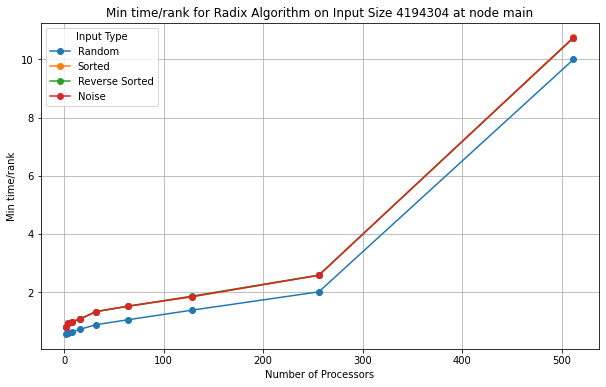
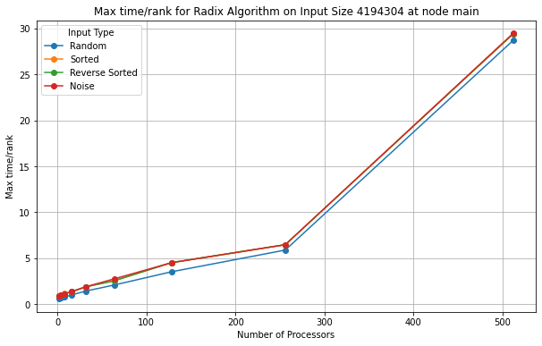
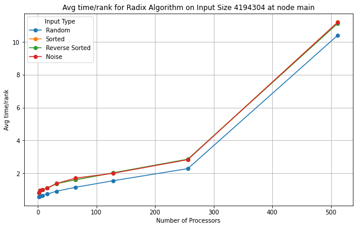
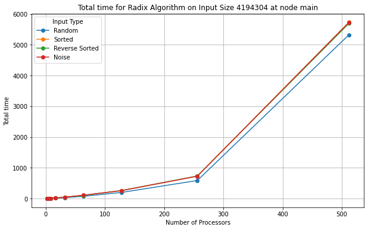
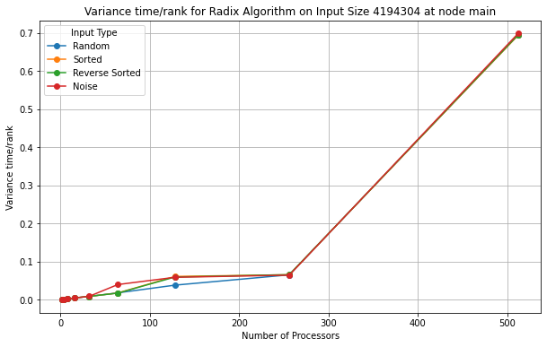

#### Comm graphs
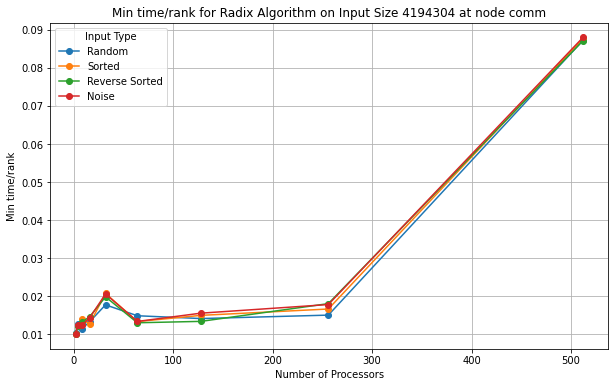
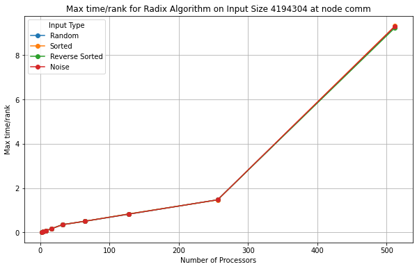
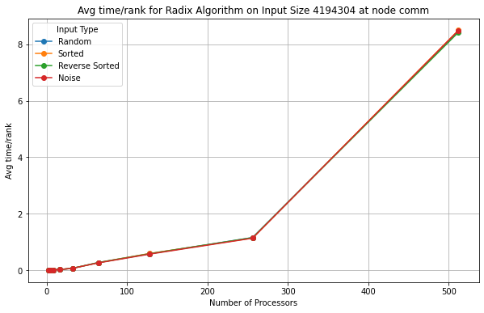
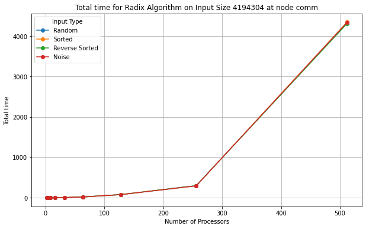
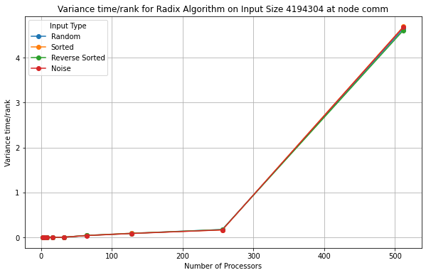

#### Comp Large graphs
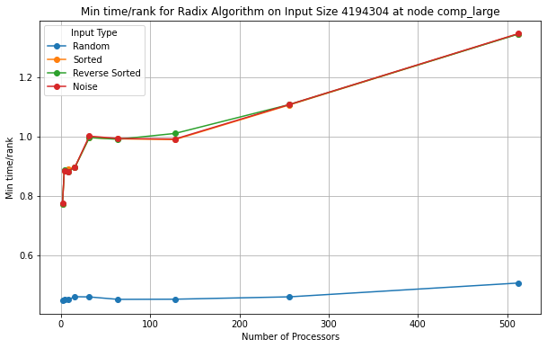

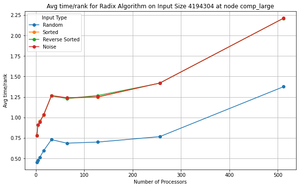
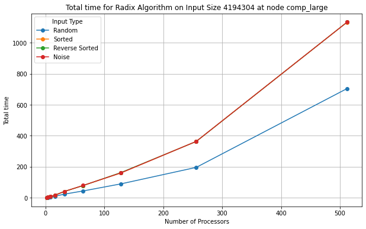
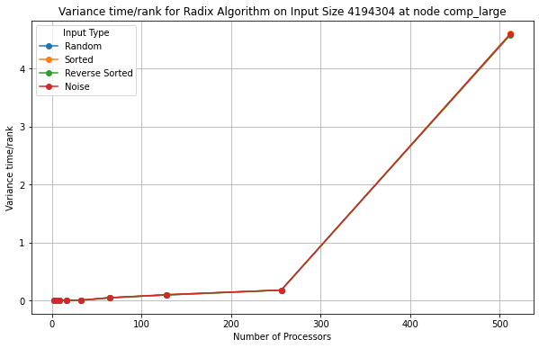

#### Analysis


### Sample Sort

- Due to not being able to run Jupiter Notebook and jobs on Grace, we couldn't provide the graphs on time, but we have provided cali files in this project, with min, max, avg, total time, and variance time/rank.
- 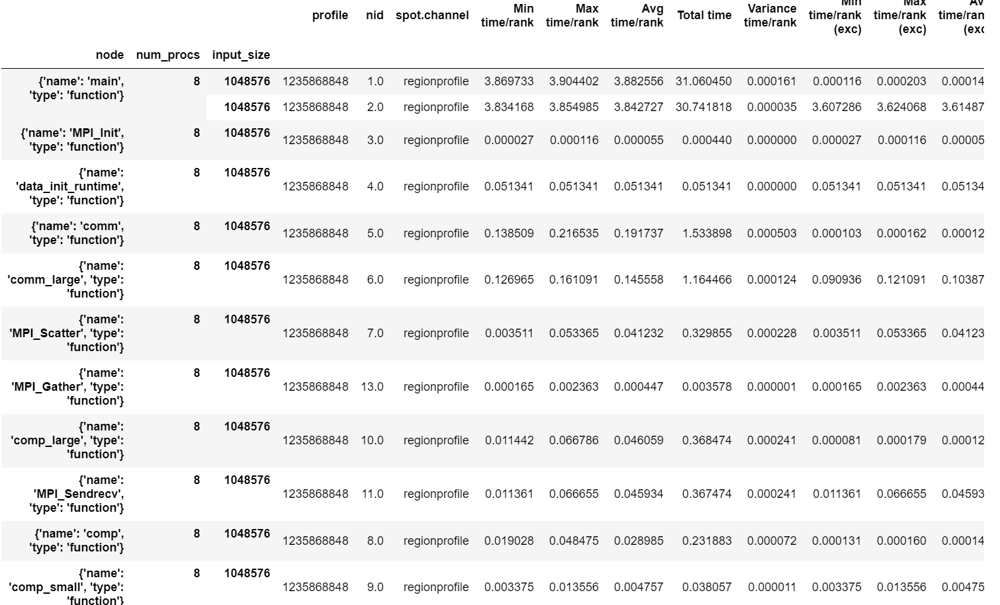
## 5. Presentation
Plots for the presentation should be as follows:
- For each implementation:
    - For each of comp_large, comm, and main:
        - Strong scaling plots for each input_size with lines for input_type (7 plots - 4 lines each)
        - Strong scaling speedup plot for each input_type (4 plots)
        - Weak scaling plots for each input_type (4 plots)

Analyze these plots and choose a subset to present and explain in your presentation.

## 6. Final Report
Submit a zip named `TeamX.zip` where `X` is your team number. The zip should contain the following files:
- Algorithms: Directory of source code of your algorithms.
- Data: All `.cali` files used to generate the plots seperated by algorithm/implementation.
- Jupyter notebook: The Jupyter notebook(s) used to generate the plots for the report.
- Report.md
